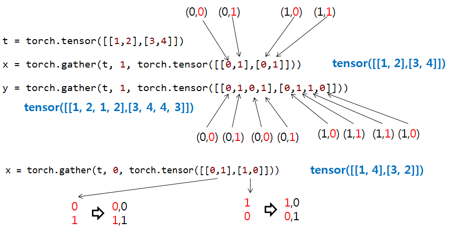
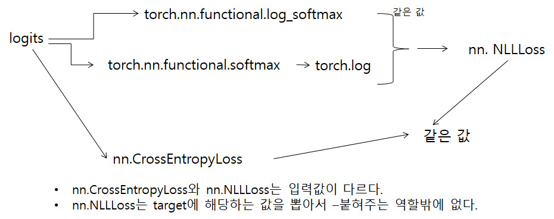

## pytorch cononical form

```
train_op = tf.train.AdamOptimizer(learning_rate=0.01).minimize(loss)   # tensorflow

net = Net()
optimizer = optim.Adam(net.parameters(), lr = 0.01)
loss_fn = nn.MSELoss()

while True:
    optimizer.zero_grad()
    y = net(x)
    loss = loss_fn(y,target)
    loss.backward()
    optimizer.step()

```


## pytorch tips
* https://pytorch.org/tutorials/
* device = torch.device('cuda' if torch.cuda.is_available() else 'cpu')
*  save & restore
```
torch.save(model.state_dict(), os.path.join(model_dir, 'epoch-{}.pth'.format(epoch)))

model.load_state_dict(torch.load('xxx.pth', map_location = device))
```
* network weights copy
```
net1.load_state_dict(net2.state_dict())
```
* PyTorch에서는 모델을 저장할 때 .pt 또는 .pth 확장자를 사용하는 것이 일반적인 규칙입니다.  ---> pt, pth는 차이 없고, 선택의 문제임.

* gradient cliping: https://pytorch.org/docs/stable/nn.html#clip-grad-norm
```
torch.nn.utils.clip_grad_norm_(model.parameters(), clip_value)
torch.nn.utils.clip_grad_value_(parameters, clip_value)
```
* learning rate 변경
```
def adjust_learning_rate(optimizer, lr):
    for param_group in optimizer.param_groups:
        param_group['lr'] = lr
```
* torch.gather
<p align="center">  </p>

* Attention Mask: http://juditacs.github.io/2018/12/27/masked-attention.html


## pytorch image load
```
import torchvision.models as models
import torchvision.transforms as transforms
import os
class MyVGG(nn.Module):
    def __init__(self,original_model):
        super(MyVGG, self).__init__()
        # vgg16에는 features, avgpool, classifier로 나누어져 있다.
        self.features = nn.Sequential(
            # features에서 마지막 3번재
            *list(original_model.features.children())[:-3]
        )
    def forward(self, x):
        x = self.features(x)
        return x 
os.environ['TORCH_HOME'] = './pretrained'
vgg16 = models.vgg16(pretrained=True, progress=True)  # 528M

transform=transforms.Compose([ transforms.ToTensor(),transforms.Normalize(mean=[0.485, 0.456, 0.406],std=[0.229, 0.224, 0.225])])
img = Image.open('dog.jpg')  # (576, 768, 3)
img = transform(img)  # torch.Size([3, 576, 768])

imgs = torch.unsqueeze(img,0)

feature1 = vgg16(imgs)  # ---> (N,1000)

extractor = MyVGG(vgg16)

featres2 = extractor(imgs)

```


## pytorch 기본 연산
import torch.nn.functional as F

F.linear(input, weight, bias=None)  y=xA^T + b
Input: (N, *, in_features) where * means any number of additional dimensions
Weight: (out_features, in_features)(out_features,in_features)
```
x = torch.randn(2,3)
w = torch.randn(3,4)
b = torch.randn(4)
x.mm(w) +b  # x.matmul(w)+b = torch.mm(x,w)+b = torch.nn.functional.linear(x,w.T,b)   ---> dot(벡터,벡터), mv(행렬,벡터), mm(행렬,행렬) ---> matmul이 모두 커버.
```

batch matrix multiplication
```
toch.bmm(A,B) # A(N,n,m) B:(N,m,k)  ---> (N,n,k)
```

## pytorch Loss
<p align="center">  </p>

```
# NLLLoss: negative log likelihood loss
# CrossEntropyLoss  == (logit -> softmax -> log -> NLLLoss)
# NLLLoss는 넣어주는 값중에 lable에 해당하는 값에 마이너스 붙혀주는 역할.
with torch.no_grad(): 
    loss1 = nn.NLLLoss()
    loss2 = nn.CrossEntropyLoss()

    logit = torch.tensor([[1.0,2.0,1.5],[3.0,1.0,4.0]], requires_grad=True, dtype=torch.float)

    target = torch.tensor([2,1])   # target label  ---> one hot 2 == (0,0,1)

    # logit(N, n_class), target: N
    loss1_ = loss1(logit, target)   # -torch.mean(logit[np.arange(2),target])
    loss2_ = loss2(logit, target)   # cross entropy loss

    print(loss1_,loss2_)


    softmax_val = torch.nn.functional.softmax(logit,1)
    log_softmax_val = torch.log(softmax_val)  # logit.log_softmax(1) 값과 같다.
    print("softmax: ", softmax_val)
    print("log-softmax: ", log_softmax_val)
    print("Cross Entropy loss: ", -torch.mean(log_softmax_val[np.arange(2),target]))

    print("Cross Entropy Loss by NLLLosss: ", loss1(log_softmax_val,target))

    print("NLLLost: ", -torch.mean(logit[np.arange(2),target]))  # logit[np.arange(batch_size), target]

```


## pytorch tensor
```
x = torch.randn((2,1), requires_grad=True)


y = x.cpu().detach()  # x는 영향 받지 않는다.
z = x.cpu().data      # x는 영향 받지 않는다.

print(x,y,z)

w = np.random.randn(2,1)

x.data = torch.from_numpy(w)  # tensor x의 data를 변경  ---> id(x)는 바뀌지 않음

x = torch.from_numpy(w)  # tensor x 자체를 변경 id(x)가 변경 됨
print(x,y,z)
print('done')
```

## torch.nn.utils.rnn.pad_sequence
```
batch = [torch.randn((3,2)),torch.randn((6,2)),torch.randn((4,2))]  # (T,D) <---T가 각기 다르다.
batch = torch.nn.utils.rnn.pad_sequence(batch, batch_first=True, padding_value=0.)  # ---> shape: (3,6,2) = (N,T,D)
```

## image classification from pretrained models
```
# resnet50, inceptin_v3의 pretrained weight로 분류해보기.
# https://github.com/pytorch/vision/issues/484   ---> imagenet_classes.txt, imagenet_synsets.txt

with open('imagenet_synsets.txt', 'r') as f:
    synsets = f.readlines()
synsets = [x.strip() for x in synsets]
splits = [line.split(' ') for line in synsets]
key_to_classname = {spl[0]:' '.join(spl[1:]) for spl in splits}
with open('imagenet_classes.txt', 'r') as f:
    class_id_to_key = f.readlines()

class_id_to_key = [x.strip() for x in class_id_to_key]  # ['n01440764', 'n01443537', 'n01484850', ...]

os.environ['TORCH_HOME'] = './pretrained'   # default: C:\Users\BRAIN/.cache\torch

model = models.resnet50(pretrained=True, progress=True)  # 106M
#model = models.inception_v3(pretrained=True, progress=True)  # 100M

transform = transforms.Compose([
            transforms.Resize(256),
            transforms.CenterCrop(224),
            transforms.ToTensor(),  #(H,W,C) --> (C,H,W)
            transforms.Normalize([0.485, 0.456, 0.406], [0.229, 0.224, 0.225])
        ])

img = Image.open('creative_commons_elephant.jpg')  # dog(576, 768, 3) elephant(600, 899, 3) ---> np.array(img)해 보면, uint8
img = transform(img)  # torch.Size([3, 224, 224])   ---> eg. -1.91 ~ 2.36 사이 값

imgs = torch.unsqueeze(img,0)

model.eval()
pred = model(imgs)  # ---> (N,1000)  ---> softmax 취하기 전.
pred = pred[0]
_,class_id = pred.max(-1)


class_key = class_id_to_key[class_id]
classname = key_to_classname[class_key]

print("{}".format(classname))


_, indices = torch.sort(pred, descending=True)
percentage = torch.nn.functional.softmax(pred) * 100


result =[(key_to_classname[class_id_to_key[idx]], percentage[idx].item()) for idx in indices[:5]]
print(result)

```
